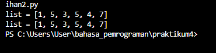

# Latihan 9 Bahasa Pemrograman
## Buat sebuah list sebanyak 5 elemen dengan nilai bebas
### Akses list:
* Tampilkan elemen ke 3
* Ambil nilai elemen ke 2 sampai elemen ke 4
* Ambil elemen terakhir

## Programnya
``````    python
    # akses list
     my_list_a =[1, 5, 6, 8, 7]
    print("element ke 3 =", my_list_a[3])
    print("element ke 2 sampai ke 4 =", my_list_a[2:4])
    print("element terakhir =",my_list_a[-1])
``````
### Outputnya:


### Ubah elemen list:
* Ubah elemen ke 4 dengan nilai lainnya
* Ubah elemen ke 4 sampai dengan elemen terakhir

## Programnya
 ``````   python
    # ubah elemen list
    my_list_a =[1, 5, 6, 8, 7]
    my_list_a[2] = 3
    my_list_a[3:4] = [5, 4]

    print("list =", my_list_a )
    print("list =", my_list_a )
``````
### Outputnya:



### Tambah elemen list:
* Ambil 2 bagian dari list pertama (A) dan jadikan list ke 2 (B)
* Tambah list B dengan nilai string
* Tambah list B dengan 3 nilai
* Gabungkan list B dengan list A

## Programnya
``````   python
    # tambah elemen list
    my_list_a =[1, 5, 6, 8, 7]
    my_list_b = my_list_a[0:2]
    my_list_b.append("Hello")
    my_list_b.extend([1, 2, 3])
    my_list_c = my_list_a + my_list_b

    print("List A =", my_list_a)
    print("List B =", my_list_b)
    print("List C =", my_list_c)
``````
### Outputnya :


### Output dari semua latihan diatas:


# Praktikum 4 Bahasa Pemrograman
## Buat program sederhana untuk menambahkan data kedalam sebuah list dengan rincian sebagai berikut:
* Progam meminta memasukkan data sebanyak-banyaknya (gunakan perulangan)
* Tampilkan pertanyaan untuk menambah data (y/t?), apabila jawaban t (Tidak), maka program akan menampilkan daftar datanya.
* Nilai Akhir diambil dari perhitungan 3 komponen nilai (tugas: 30%, uts: 35%, uas: 35%)
* Buat flowchart dan penjelasan programnya pada README.md.

## Flowchartnya:


## Programnya:
``````    python
    # LIST
    nama = []
    nim = []
    nilaiTugas = []
    nilaiUTS = []
    nilaiUAS = []
    nilaiAkhir = []

    print()

    # Input
    while True:
    nama.append(input("Masukan Nama : "))
    nim.append(input("Masukan NIM  : "))
    Tugas = int(input("Nilai Tugas  : ")); 
    nilaiTugas.append(Tugas)
    UTS   = int(input("Nilai UTS    : ")); 
    nilaiUTS.append(UTS)
    UAS   = int(input("Nilai UAS    : ")); 
    nilaiUAS.append(UAS)

    nilaiAkhir.append(Tugas * 30/100 + UTS * 35/100 + UAS * 35/100)

    print()
    _tanya = input("Tambah data ? [y/t]: ")
    print()
    if(_tanya == "t"):
        break

# Output
    print("+----+-----------------------+--------+--------+-------+-------+---------+")
    print("| {0:^2} | {1:^18} | {2:^9} | {3:^6} | {4:^5} | {5:^5} | {6:^7} |".format("No", "Nama", "NIM", "Tugas", "UTS", "UAS", "Akhir"))
    print("-----+-----------------------+--------+--------+-------+-------+---------+")

    no = 0
    for nama, nim, Tugas, UTS, UAS, nilaiAkhir in zip(nama, nim, nilaiTugas, nilaiUTS, nilaiUAS, nilaiAkhir):
        no += 1    
        print("| {0:>2} | {1:<18} | {2:>8} | {3:>6} | {4:>5} | {5:>5} | {6:>7} |".format(no, nama, nim, Tugas, UTS, UAS, nilaiAkhir))
    print("+----+-----------------------+--------+--------+-------+-------+---------+")
``````
    ### Outputnya:


